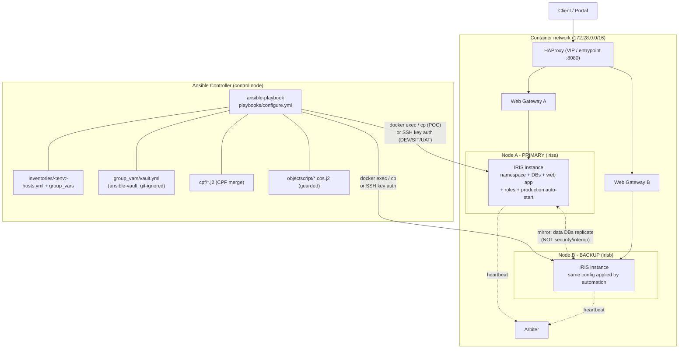
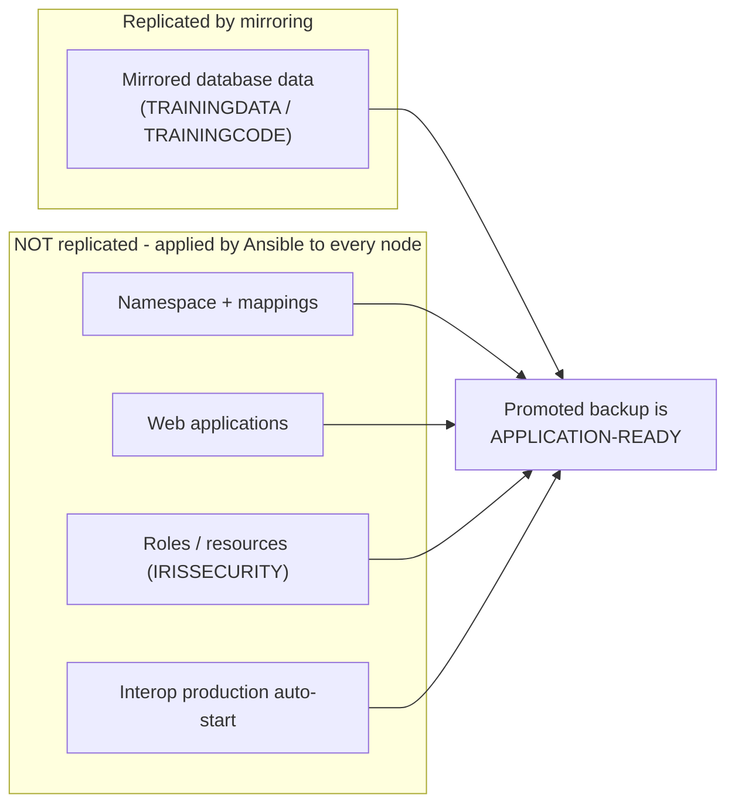

# Ansible + IRIS Architecture (Topic 1 POC)

Deliverable 5.1 #1. This diagram is kept as text (Mermaid) so it is
version-control friendly and reviewable in a PR. Export to
`ansible-iris-architecture.png` for the slide/handover pack (GitHub/most
IDEs render Mermaid; or use the Mermaid CLI / mermaid.live).

## Control + data flow

## Why automation is needed (the mirror gap)

## Access / execution method

| Environment | Connection | IRIS command execution |
| ----------- | ---------- | ---------------------- |
| POC | `ansible_connection: local` | `docker cp` + `docker exec <container> iris ...` (`iris_exec_mode: docker`) |
| DEV / SIT / UAT | SSH key auth to hosts | `iris merge` / `iris session` directly on PATH (`iris_exec_mode: direct`) |

Secrets never leave the vault/`no_log` boundary; license keys and
passwords are never committed (see `docs/secrets-and-security.md`).
