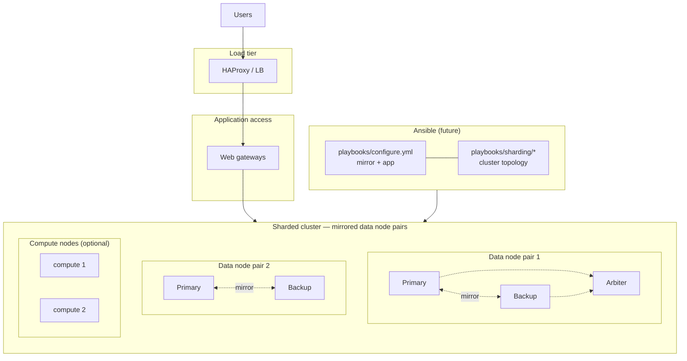

# Combined future architecture (Topic 1 + Topic 2 — conceptual only)

**Not implemented in this repo.** Documents how mirror HA (Topic 1) and
sharded scale-out (Topic 2) compose in a production-style health IT platform.

## Why keep topics separate in the POC

The assignment requires:

1. Mirror POC without sharding mixed in
2. Sharding POC as non-mirrored data nodes first
3. Modern `%SYSTEM.Cluster` API

Combining them prematurely doubles failure modes (mirror failover + shard
rebalance + security sync across N nodes).

## Conceptual combined topology

## API entry points (future)

| Step | API | Notes |
| ---- | --- | ----- |
| First mirrored data node | `$SYSTEM.Cluster.InitializeMirrored()` | Replaces `Initialize()` |
| Additional mirrored pairs | `$SYSTEM.Cluster.AttachAsMirroredNode()` | Primary then backup order |
| Non-mirrored data node | `$SYSTEM.Cluster.AttachAsDataNode()` | Topic 2 POC pattern |
| Compute tier | `$SYSTEM.Cluster.AttachAsComputeNode()` | After data plane stable |

## Automation implications

| Topic 1 pattern | Combined future need |
| --------------- | -------------------- |
| `iris_primary` / `iris_backup` groups | Per mirror **pair** groups + shard role |
| Security sync primary→backup | Per-pair or cluster-wide strategy (TBD) |
| HAProxy primary detection | May front compute nodes or gateways |
| CPF + guarded ObjectScript | Same rules; separate playbook trees merged via feature flag |

## Suggested integration approach (later sprint)

1. Ship Topic 1 and Topic 2 independently (this repo) ✅
2. Add `inventories/sharded_ha/` with paired hosts
3. New playbooks: `playbooks/sharding/setup_mirrored_cluster.yml`
4. Optional `configure.yml` import behind `sharding_enabled: false` default
5. Combined validation: mirror JSON + sharding JSON per pair

## Health IT note

Clinical uptime often requires **mirrored sharded data nodes** plus
operational runbooks for:

- Failover within a pair during shard rebalance
- Security consistency across compute nodes
- Backup/DR separate from shard partition layout

See [docs/sharding/recommendation.md](../docs/sharding/recommendation.md)
and [docs/sharding/ha-mirroring-considerations.md](../docs/sharding/ha-mirroring-considerations.md).

**Do not run combined topology in the assignment POC without explicit scope change.**
