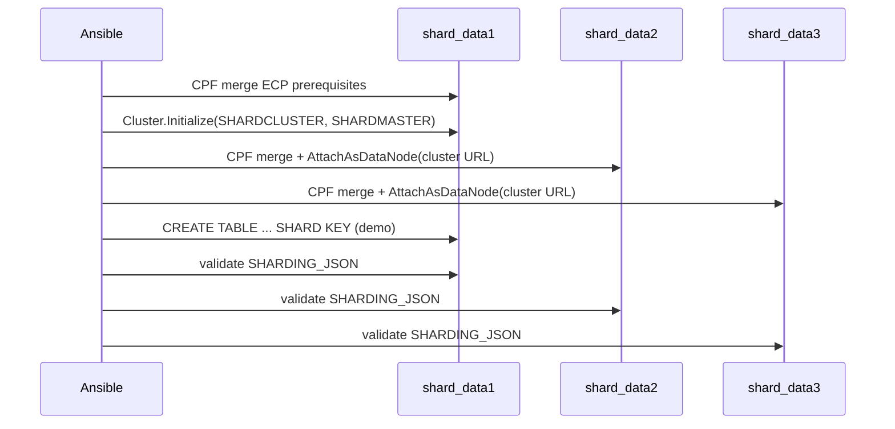
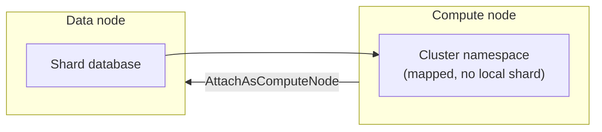

# Sharding architecture (Topic 2 POC)

Deliverable §5.2 diagram. Mermaid source for export to
`sharding-architecture.png` (Mermaid CLI or mermaid.live).

## Data-node-only cluster (this POC)

```mermaid
flowchart TB
  subgraph CTRL["Ansible controller"]
    AP["ansible-playbook\nplaybooks/sharding/configure_sharding.yml"]
    INV["inventories/sharding\nshard_data1..3"]
    CPF["cpf/sharding/*.j2"]
    OS["objectscript/sharding/*.cos.j2"]
    AP --- INV
    AP --- CPF
    AP --- OS
  end

  subgraph NET["Docker shard_net 172.29.0.0/16"]
    direction TB
    subgraph N1["Node 1 — shard_data1 (172.29.0.10)"]
      MNS["Master namespace\nSHARDMASTER\n(nonsharded meta + code)"]
      CNS1["Cluster namespace\nSHARDCLUSTER"]
      SH1["Shard DB 1"]
      MNS -. maps to .-> CNS1
      SH1 -. shard map .-> CNS1
    end
    subgraph N2["Data node 2 — shard_data2"]
      CNS2["Cluster namespace\nSHARDCLUSTER"]
      SH2["Shard DB 2"]
      SH2 -.-> CNS2
    end
    subgraph N3["Data node 3 — shard_data3"]
      CNS3["Cluster namespace\nSHARDCLUSTER"]
      SH3["Shard DB 3"]
      SH3 -.-> CNS3
    end
  end

  AP -- "docker exec / cp" --> N1
  AP --> N2
  AP --> N3

  N1 <-- "ECP / Cluster API\nAttachAsDataNode" --> N2
  N1 <-- --> N3
  N2 <-.-> N3

  APP["SQL / ObjectScript client"] --> CNS1
  APP --> CNS2
  APP --> CNS3
```

## Setup sequence



## Optional compute node (stretch — not in default compose)



## Port map (host)

| Container | Superserver | Web |
| --------- | ----------- | --- |
| shard_data1 | 41773 | 42773 |
| shard_data2 | 43773 | 44773 |
| shard_data3 | 45773 | 46773 |

## Export to PNG

```bash
npx @mermaid-js/mermaid-cli -i architecture/sharding-architecture.md \
  -o architecture/sharding-architecture.png
```

See [architecture/README.md](README.md) for general export notes.
