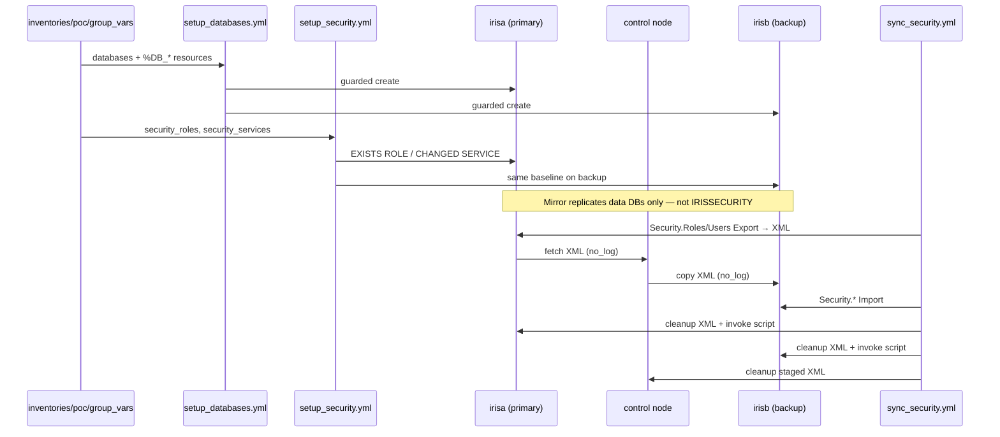

# Secrets & Security Handling

This POC is designed so that **no secret is ever committed to git** and no
credential is printed to logs or the console.

For the full mirror security story (IRISSECURITY not mirrored, bootstrap vs
sync, Portal checks, demo commands), see **[security-overview.md](security-overview.md)**.

---

## When to run what (security operations)

| Goal | Playbook | Secrets involved? |
| ---- | -------- | ------------------- |
| Baseline services + roles on **every** node | `setup_security.yml` (part of `configure.yml`) | Only if `-e rotate_admin_password=true` (vault) |
| Copy roles/users primary → backup after mirror | `sync_security.yml` | Export XML has **password hashes** — treated as sensitive (`no_log`, deleted after run) |
| Read-only audit of roles/users counts | `validate_security_sync.yml` | No |

Typical order: `setup_databases.yml` → `setup_security.yml` on all nodes →
mirror up → `sync_security.yml` → optional `validate_security_sync.yml`.



---

## 1. What counts as a secret here

- IRIS **license key** (`iris.key`)
- The IRIS **admin/automation password** (`_SYSTEM` or a dedicated user)
- Any application service-account password
- Anything else that grants privileged access

None of these appear in tracked files.

---

## 2. Where secrets live

| Secret | Storage | How it is consumed |
| ------ | ------- | ------------------ |
| `iris.key` | Provided at run time (`-e iris_key_source=/secure/path/iris.key`) or placed manually in `irisa/`, `irisb/` | Copied by `prepare.yml` with `no_log: true`; targets are git-ignored |
| Admin password | `group_vars/vault.yml`, encrypted with **ansible-vault** | Read only when `rotate_admin_password=true`; used in a task with `no_log: true` |
| App password | Same vault file | Same pattern |

`group_vars/vault.example.yml` is committed as a **template only** and
contains placeholder values (`CHANGE_ME`). The real `group_vars/vault.yml`
is git-ignored.

---

## 3. Creating and using the vault

```bash
# 1. Create the real vault from the template
cp group_vars/vault.example.yml group_vars/vault.yml

# 2. Put real values in it, then encrypt
ansible-vault encrypt group_vars/vault.yml

# 3. Use it at run time (rotating the admin password)
ansible-playbook playbooks/setup_security.yml -i inventories/poc \
  -e rotate_admin_password=true --ask-vault-pass
# or non-interactively:
#   --vault-password-file ~/.iris_vault_pass
```

Edit later with `ansible-vault edit group_vars/vault.yml`.

---

## 4. Controls in place

- **`.gitignore`** blocks `*.key`, `*.ISCkey`, `.env`, `group_vars/vault.yml`,
  `**/vault.yml`, and generated evidence output.
- **`no_log: true`** on every task that touches a key or password
  (license copy, vault load, password rotation) so values never reach
  logs or `-v` output.
- **Templated security script is deleted** after execution from both the
  node and the control node, so a rendered password never lingers on disk.
- **Least privilege**: playbooks run with `become: false` and assume a
  dedicated automation account rather than root. CPF merges never contain
  credentials.
- **Password rotation is opt-in** (`rotate_admin_password=false` by
  default) so a normal `configure` run does not touch credentials.

---

## 5. What is intentionally NOT done

- No plaintext passwords, license keys, or `iris.key` are stored in the
  repo or in any CPF/ObjectScript template.
- CPF merge files carry only non-secret configuration (databases,
  namespaces, mappings, service enablement).
- The default password is only changed when explicitly requested; the
  POC does not hardcode a "first login" password anywhere.

---

## 6. Verifying no secrets leaked

Before committing:

```bash
git status                        # vault.yml, *.key, .env must be untracked/ignored
git grep -nE "password|iris\.key" -- . ':!docs' ':!*.example.yml'   # expect no plaintext values
```

Rotate the admin password immediately after the POC and revoke any
temporary automation credentials.
