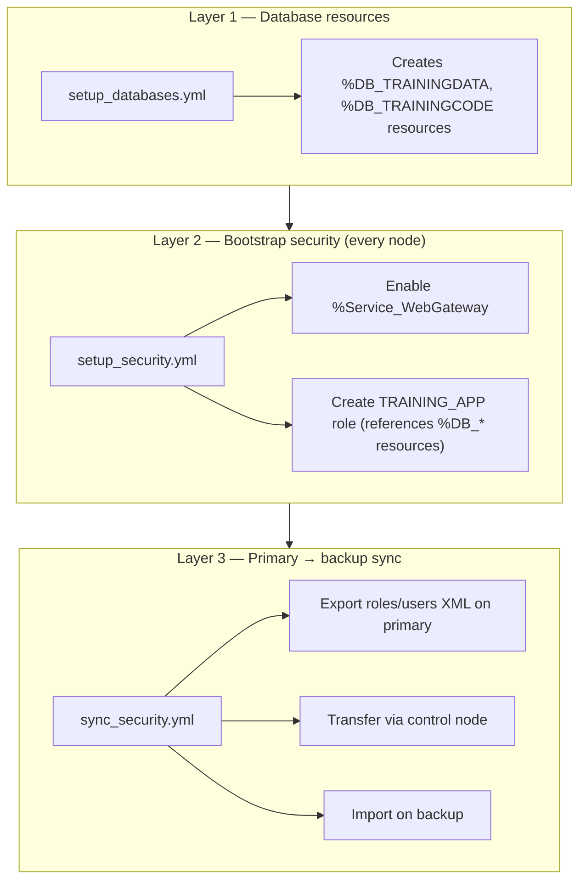

# IRIS Security Overview (Topic 1)

A practical guide to how this POC handles IRIS security across a mirrored
two-node topology. Read this in ~5 minutes, then run the commands below to
demo security bootstrap and primary→backup sync without prior context.

**All topics:** [docs/README.md](README.md)

**Related docs:** [Secrets & vault handling](secrets-and-security.md) ·
[Mechanism mapping](mechanism-mapping.md) ·
[Ansible runbook §5b](ansible-runbook.md#5b-security-sync-primary--backup) ·
[Configure flow — security sync](configure-flow-explained.md#12-step-9-security-sync--sync_securityyml)

---

## The problem: IRISSECURITY is not mirrored

IRIS database mirroring replicates **data databases** (globals, routines in
mirrored DBs). It does **not** replicate the **IRISSECURITY** database.

That means:

| What mirrors | What does **not** mirror |
| ------------ | ------------------------ |
| `TRAININGDATA`, `TRAININGCODE` (configured in inventory) | Roles, users, resources in IRISSECURITY |
| Journaled namespace globals (via mirrored DBs) | Service enablement, web app security objects |
| Code/routines in mirrored code DB | Password hashes, role membership |

After failover, the backup can have current data but **stale or missing**
security objects unless you apply them consistently on every node.

This POC closes the gap with **three layers** (see below).

---

## Three layers of security in this repo



| Layer | Playbook | Runs on | Mechanism | Purpose |
| ----- | -------- | ------- | --------- | ------- |
| 1 | `setup_databases.yml` | all nodes | Guarded ObjectScript | Create physical DBs **and** `%DB_<name>` resources roles depend on |
| 2 | `setup_security.yml` | all nodes | Guarded ObjectScript | Enable services, create roles; optional vault password rotation |
| 3 | `sync_security.yml` | primary → backup | `Security.*` Export/Import + file transfer | Copy roles/users (with password hashes) from primary to backup |

Layer 2 runs during `configure.yml` on **both** nodes so each node has a
baseline. Layer 3 runs **after** mirror is up to align backup with primary
for anything that changed only on primary (or to prove E2E sync).

Optional read-only check: `validate_security_sync.yml` on all nodes.

---

## Which playbook does what

| Playbook | When to run | Mutates? | Key output |
| -------- | ----------- | -------- | ---------- |
| `setup_security.yml` | First configure; after changing `security_roles` / `security_services` in inventory | Yes (guarded) | `EXISTS ROLE …`, `CHANGED SERVICE …`, `PWROTATE` |
| `sync_security.yml` | After bootstrap + mirror; after primary-side security changes | Yes (export/import) | `SECURITY_SYNC_JSON:…`, `roles_imported`, `users_imported` |
| `validate_security_sync.yml` | After sync; anytime to audit | No | `SECURITY_SYNC_JSON` with `role_count`, `user_count`, required lists |

Gates:

- `security_sync_enabled=true` (or set in `inventories/poc/group_vars/all.yml`)
- `mirror_enabled=true` for sync playbook install/export/import path

Secrets: exported XML contains **password hashes**, not plaintext. Playbooks
use `no_log`, delete XML and invoke scripts after each run. See
[secrets-and-security.md](secrets-and-security.md).

---

## Mechanisms (how Ansible applies security)

| Item | Mechanism | Why not CPF? | Where |
| ---- | --------- | ------------ | ----- |
| `%DB_*` resources | Guarded ObjectScript | Resources are security objects | `create_databases.cos.j2` |
| Service enablement | Guarded ObjectScript | CPF merge rejects `[Services]` (`ERROR #415`) | `setup_security.cos.j2` |
| Application roles | Guarded ObjectScript | Security API | `setup_security.cos.j2` |
| Admin password | Guarded ObjectScript + ansible-vault | Secret-bearing; opt-in | `setup_security.yml`, `vault.yml` |
| Roles/users sync | `Security.Roles/Users`.Export/Import | Official API; preserves hashes | `SecuritySync.*`, `sync_security.yml` |

Full table: [mechanism-mapping.md](mechanism-mapping.md).

---

## Commands (from repo root)

Set a short variable (macOS/Linux):

```bash
cd /Users/aryand/Desktop/ansible-iris-automation
INV=inventories/poc
```

### Bootstrap security (both nodes)

Usually included in full configure:

```bash
ansible-playbook playbooks/configure.yml -i $INV
```

Or run security alone (after databases — roles need `%DB_*` resources):

```bash
ansible-playbook playbooks/setup_security.yml -i $INV
```

Optional password rotation from vault:

```bash
ansible-playbook playbooks/setup_security.yml -i $INV \
  -e rotate_admin_password=true --ask-vault-pass
```

### Sync primary → backup (real import)

```bash
ansible-playbook playbooks/sync_security.yml -i $INV \
  -e security_sync_enabled=true \
  -e security_sync_dry_run=false
```

### Dry-run import (validate XML counts, no changes on backup)

```bash
ansible-playbook playbooks/sync_security.yml -i $INV \
  -e security_sync_enabled=true \
  -e security_sync_dry_run=true
```

### Post-sync validation (read-only, all nodes)

```bash
ansible-playbook playbooks/validate_security_sync.yml -i $INV \
  -e security_sync_enabled=true
```

### E2E proof with deliberate primary-only delta

Creates `SYNC_TEST_ROLE` and `sync_test_user` on primary, then exports and imports:

```bash
ansible-playbook playbooks/sync_security.yml -i $INV \
  -e security_sync_enabled=true \
  -e security_sync_dry_run=false \
  -e security_sync_create_test_delta=true \
  -e 'security_sync_required_users=["sync_test_user"]' \
  -e write_evidence=true
```

Evidence (optional): `evidence/security-sync-poc.json`,
`evidence/security-sync-validate-poc-<host>.json`.

---

## Expected output markers

| Marker | Where | Meaning |
| ------ | ----- | ------- |
| `EXISTS ROLE TRAINING_APP` | `setup_security` session | Role already present (idempotent re-run) |
| `CREATED ROLE …` | bootstrap or test delta | New role created |
| `EXISTS SERVICE %Service_WebGateway` | bootstrap | Web gateway service enabled |
| `Roles exported: N` | export (logger) | Export succeeded |
| `SECURITY_SYNC_JSON:{"ok":true,…}` | all SecuritySync steps | Machine-readable result; playbook parses this line |
| `roles_imported` / `users_imported` > 0 | import JSON | Backup received objects |
| `failed=0` | Ansible recap | Play succeeded |

Example import JSON fields (abbreviated):

```json
{
  "ok": true,
  "step": "import_complete",
  "roles_imported": 12,
  "users_imported": 5,
  "role_count": 12,
  "user_count": 5,
  "errors": []
}
```

---

## Management Portal verification

Use **`.csp`** URLs (not `.cs`). Web Gateway ports map to each node:

| Node | URL |
| ---- | --- |
| Primary (`irisa`) | http://localhost:8081/csp/sys/UtilHome.csp |
| Backup (`irisb`) | http://localhost:8082/csp/sys/UtilHome.csp |

Log in with your admin account (default POC may still use factory `_SYSTEM`
until you rotate via vault).

Check **both** portals after bootstrap and again after sync:

| Portal path | What to verify |
| ----------- | -------------- |
| System Administration → Security → **Roles** | `TRAINING_APP` exists on both nodes; after E2E delta, `SYNC_TEST_ROLE` on backup |
| System Administration → Security → **Resources** | `%DB_TRAININGDATA`, `%DB_TRAININGCODE` (from database setup) |
| System Administration → Security → **Services** | `%Service_WebGateway` enabled |
| System Administration → Security → **Users** | After E2E delta, `sync_test_user` on backup |

Primary and backup should match for synced roles/users. Resource and service
state should match because bootstrap ran on all nodes.

Quick HTTP check (200 OK):

```bash
curl -s -o /dev/null -w "%{http_code}\n" http://localhost:8081/csp/sys/UtilHome.csp
curl -s -o /dev/null -w "%{http_code}\n" http://localhost:8082/csp/sys/UtilHome.csp
```

---

## 2–5 minute demo script (talking points)

1. **Problem (30 s)** — "Mirroring copies data DBs, not IRISSECURITY. Failover
   without sync can leave wrong roles/users on the backup."

2. **Desired state (30 s)** — Show `inventories/poc/group_vars/all.yml`:
   `security_roles`, `security_services`, `security_sync_*`. "Declarative;
   same playbooks for dev/sit/uat."

3. **Bootstrap (45 s)** — Run or point at `setup_security.yml` output:
   `EXISTS ROLE TRAINING_APP`. "Every node gets services and roles; DB
   resources were created first in `setup_databases.yml`."

4. **Sync (60 s)** — Run `sync_security.yml` with `-e security_sync_dry_run=false`.
   Highlight `SECURITY_SYNC_JSON` and `roles_imported` / `users_imported`.
   "Export on primary, XML crosses the control node, import on backup; XML
   deleted after."

5. **Prove it (45 s)** — Portal on 8082: Roles → `TRAINING_APP`. Optional E2E
   delta + `sync_test_user`. Or run `validate_security_sync.yml` and show
   JSON counts.

6. **Secrets (30 s)** — "No passwords in git; vault for rotation; `no_log` on
   sensitive tasks." See [secrets-and-security.md](secrets-and-security.md).

Full walkthrough: [demo-script.md § Security demo](demo-script.md#9-security-demo-primary--backup-sync).

---

## Troubleshooting

| Symptom | Likely cause | Fix |
| ------- | ------------ | --- |
| Sync play skipped / no export | `security_sync_enabled=false` or `mirror_enabled=false` | Set `-e security_sync_enabled=true`; ensure mirror configured |
| Export assert: `roles_exported` is 0 | SecuritySync not installed or empty primary | Check install play; run `setup_security.yml` on primary first |
| `Security export … no SECURITY_SYNC_JSON` | Compile/install failed | Re-run sync; check `install_security_sync` assert output |
| Role create `#892 Resource … does not exist` | Bootstrap order wrong | Run `setup_databases.yml` before `setup_security.yml` |
| Portal 404 or wrong app | URL uses `.cs` instead of `.csp` | Use `…/UtilHome.csp` |
| Gateway shows error page | Stale `webgateway*/durable` or CSP.ini | Re-run `prepare.yml`; see [ansible-runbook.md §7](ansible-runbook.md#8-troubleshooting) |
| Import OK but backup missing role | Only ran dry-run | `-e security_sync_dry_run=false` |
| Required user missing in validate | User not in export set or not synced | Add to `security_sync_required_users`; re-sync |

Partial recovery: fix the layer that failed and re-run that playbook only
(`--limit irisa` / `--limit irisb` if needed).

---

## File map (security)

| Area | Files |
| ---- | ----- |
| Bootstrap | `playbooks/setup_security.yml`, `roles/iris_security/`, `objectscript/setup_security.cos.j2` |
| Sync | `playbooks/sync_security.yml`, `objectscript/invoke_security_sync.cos.j2` |
| Validate | `playbooks/validate_security_sync.yml` |
| ObjectScript module | `objectscript/security_sync/SecuritySync.*.cls` |
| Desired state | `inventories/poc/group_vars/all.yml` (`security_*`, `security_sync_*`) |
| Install helper | `roles/iris_common/tasks/install_security_sync.yml` |
